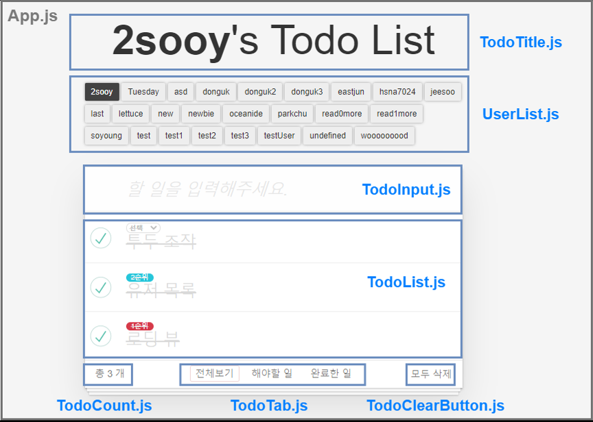

# ☕️ 코드리뷰 모임 - Black Coffee

<br>

> '훌륭한 의사소통은 블랙커피처럼 자극적이며, 후에 잠들기가 어렵다'. <br> A.M. 린드버그(미국의 작가, 수필가) -

<br>

블랙커피처럼 서로를 자극해주고, 동기부여 해주며, 그 성장과정으로 인해 의미있는 가치를 만들어내고자 하는  
**프론트엔드 코드리뷰 모임** ☕️ **Black Coffee**입니다.

<br>

## 🎨 구조

```sh
├── index.html
├── css
│   └── app.css
└── js
    ├── index.js
    ├── Components
    │   ├── App.js             # state 관리 및 모든 하위 컴포넌트 관리
    │   ├── LoadingView.js     # api 요청시 사용자에게 보여줄 로딩 컴포넌트
    │   ├── TodoClearButton.js # 모든 todo item을 삭제하는 컴포넌트
    │   ├── TodoCount.js       # 활성화 된 tab에 따라 todo item 개수를 보여주는 컴포넌트
    │   ├── TodoInput.js       # 사용자의 입력을 받아 todo item을 추가하는 컴포넌트
    │   ├── TodoList.js        # 선택된 사용자의 todo list를 보여주고, todo item 조작을 위한 컴포넌트
    │   ├── TodoTab.js         # 전체, 미완료, 완료에 대한 tab을 제공하는 컴포넌트
    │   ├── TodoTitle.js       # 선택된 유저의 이름을 보여주는 title 컴포넌트
    │   └── UserList.js        # 서버 내 저장된 유저들의 목록 제공 및 유저 선택을 위한 컴포넌트
    └── utils
        ├── api.js
        ├── constant.js
        ├── template.js        # 컴포넌트에서 rendering될 html markup을 모은 유틸
        └── validator.js
```



<br>

## 🧀 구현 사항

- [x] todoItem 불러오기
- [x] todoItem 추가하기
- [x] todoItem 삭제하기
- [x] todoItem complete하기
- [x] todoItem contents 내용 수정하기
- [x] user별 투두리스트 불러오기
- [x] 데이터를 불러오기전 로딩바를 이용해, 사용자가 데이터가 불러와지고 있다는 것을 보여줍니다.
- [x] github issue에서 라벨을 붙이는 것처럼, 우선순위에 따라서 badge를 추가합니다.

## 🍦 배운 것

- 모든 API 요청 시 중복되는 fetch API 구조에 대해 api라는 객체로 관리하기
- `<selct>` 태그 및 `change 이벤트`
- Todo Item 변경 시 `.select()` 메소드
- 각 컴포넌트에서 사용하는 `html markup`에 해당하는 부분 `template`으로 모듈화

## 🍞 고민한 것

- App의 state를 어떻게 설계할 것인가 ?
  ```js
  this.state = {
    user: {
      name: '',
      todos: [],
    },
    users: [],
    selectedTab: '',
  };
  ```
- 각각의 하위 컴포넌트는 어떤 state를 가져야 하는가 ?
- api 요청은 어디에서 진행해야 하는가 ?
- 로딩 시점은 어느 곳이 적절한지 ?
- 각종 발생할 수 있는 예외사항
  - 선택된 유저가 없는 상태에서 어플리케이션 조작

<br>

## 📝 License

This project is [MIT](https://github.com/next-step/js-todo-list/blob/master/LICENSE) licensed.
