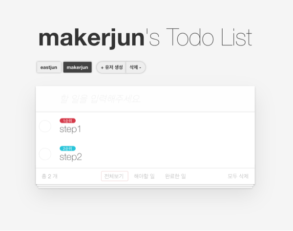

<p align="middle" >
  
</p>
<h2 align="middle">JS 투두리스트 스텝2</h2>
<p align="middle">자바스크립트와 AJAX를 이용하여 구현 하는 투두리스트</p>
<p align="middle">
  
  
  
  
  <a href="https://github.com/next-step/js-todo-list-step2/blob/main/LICENSE" target="_blank">
    
  </a>
</p>

## 🔥 Projects!

<p align="middle">
  
</p>

<p align="middle">
  <a href="https://next-step.github.io/js-todo-list-step2/">🖥️ 데모 링크</a>
</p>

<br/>

## 🎯 요구사항

-   [x] 1. User 추가하기
-   [x] 2. User의 투두리스트 불러오기
-   [x] 3. User 삭제하기
-   [x] 4. todoItem 추가하기
-   [x] 5. todoItem 불러오기
-   [x] 6. todoItem complete하기
-   [x] 7. todoItem 삭제하기
-   [ ] 8. todoItem contents 내용 수정하기

<br/>

## 🎯🎯 심화 요구사항

-   [ ] 1. fetch api 사용하는 부분을 async await을 사용하여 리팩토링하기.
-   [ ] 2. github issue에서 라벨을 붙이는 것처럼, 우선순위에 따라서 label를 추가하기.
-   [ ] 3. ES6 impot & export를 이용해 자바스크립트 파일을 리팩토링하기.

<br/>

## 🕵️‍♂️ 제약사항

-   [ ] 1. User의 이름은 최소 2글자 이상이어야 한다.
-   [ ] 2. TodoItem Contents는 최소 2글자 이상이어야 한다.

<br/>

## 📝 API

### User list 불러오기

| method | uri        |
| ------ | ---------- |
| GET    | /api/users |

```javascript
{
 response: [...]
}
```

### User 추가하기

| method | uri        |
| ------ | ---------- |
| POST   | /api/users |

```javascript
{
 requestBody: {
   "name": "string"
 },
 response: {
   "_id": "string",
   "name": "string",
   "todoList": []
  }
}
```

### User 불러오기

| method | uri                |
| ------ | ------------------ |
| GET    | /api/users/:userId |

```javascript
{
 response: {
   "_id": "string",
   "name": "string",
   "todoList": [...]
  }
}
```

### User 삭제하기

| method | uri                |
| ------ | ------------------ |
| DELETE | /api/users/:userId |

```javascript
{
	response: {
	}
}
```

### User의 Todo Item 불러오기

| method | uri                       |
| ------ | ------------------------- |
| GET    | /api/users/:userId/items/ |

```javascript
{
 response: [...]
}
```

### User의 Todo Item 추가하기

| method | uri                       |
| ------ | ------------------------- |
| POST   | /api/users/:userId/items/ |

```javascript
{
 requestBody: {
   "contents": "string"
 },
 response: {
   "_id": "string",
   "name": "string",
   "todoList": [...]
  }
}
```

### User의 Todo Item 전부 삭제하기

| method | uri                       |
| ------ | ------------------------- |
| DELETE | /api/users/:userId/items/ |

```javascript
{
 response: {
   "_id": "string",
   "name": "string",
   "todoList": []
  }
}
```

### User의 Todo Item 1개 삭제하기

| method | uri                              |
| ------ | -------------------------------- |
| DELETE | /api/users/:userId/items/:itemId |

```javascript
{
 response: {
   "_id": "string",
   "name": "string",
   "todoList": [...]
  }
}
```

### User의 Todo Item 내용 수정하기

| method | uri                              |
| ------ | -------------------------------- |
| PUT    | /api/users/:userId/items/:itemId |

```javascript
{
 requestBody: {
   "contents": "string"
 },
 response: {
  "_id": "string",
   "contents": "string",
   "priority": "string",
   "isCompleted": "boolean"
  }
}
```

### User의 Todo Item 우선순위 수정하기

| method | uri                                       |
| ------ | ----------------------------------------- |
| PUT    | /api/users/:userId/items/:itemId/priority |

```javascript
{
 requestBody: {
   "priority": "string" // 'NONE', 'FIRST', 'SECOND'
 },
 response: {
   "_id": "string",
   "contents": "string",
   "priority": "string",
   "isCompleted": "boolean"
  }
}
```

### User의 Todo Item complete toggle

| method | uri                                     |
| ------ | --------------------------------------- |
| PUT    | /api/users/:userId/items/:itemId/toggle |

```javascript
{
 response: {
   "_id": "string",
   "contents": "string",
   "priority": "string",
   "isCompleted": "boolean"
  }
}
```

<br/>

## ⚙️ Before Started

####  로컬에서 서버 띄워서 손쉽게 static resources 변경 및 확인하는 방법

로컬에서 웹서버를 띄워 html, css, js 등을 실시간으로 손쉽게 테스트해 볼 수 있습니다. 이를 위해서는 우선 npm이 설치되어 있어야 합니다. 구글에 `npm install` 이란 키워드로 각자의 운영체제에 맞게끔 npm을 설치해주세요. 이후 아래의 명령어를 통해 실시간으로 웹페이지를 테스트해볼 수 있습니다.

```
npm install -g live-server
```

실행은 아래의 커맨드로 할 수 있습니다.

```
live-server 폴더명
```

<br/>

## 👏🏼 Contributing

만약 미션 수행 중에 개선사항이 보인다면, 언제든 자유롭게 PR을 보내주세요.

<br>

## 🐞 Bug Report

버그를 발견한다면, [Issues](https://github.com/next-step/js-todo-list-step2/issues)에 등록해주세요.

<br>

## 📝 License

This project is [MIT](https://github.com/next-step/js-todo-list-step2/blob/main/LICENSE) licensed.
